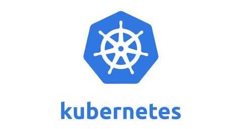

#### K8S架构/组件说明

##### 1. Borg的架构
Kubernetes 是 Borg 的 Go 语言的编译版本，在认识 Kubernetes 采用的架构之前不妨先了解 Borg 的架构：BorgMaster 负责请求分发，工作节点是 Borglet。为了防止BorgMaster发生单点故障、保证高可用集群，高可用节点最好保证三个以上的奇数个。scheduler 是调度器组件，用来确定请求交给谁处理。scheduler 不会直接和 Borglet 交互，而是把数据写入到 Paxos 数据库 ( Google )，Borglet 会监听数据库，如果有自己的请求会处理自己的请求。

##### 2. Kubernetes的架构
Kubernetes相较于Borg在某些地方是有不同的。请求的任务到来之后 scheduler 把请求的任务交给 api server，api server 负责把请求写入到 etcd，scheduler 并不会和 etcd 直接交互。
>etcd的官方将它定义一个可信赖（为了etcd持久化不造成单点故障，所以让它本身支持集群化，不需要使用其它的中间件）的分布式键值存储服务，它能够为整个分布式集群存储一些关键数据，协助分布式集群的正常运转(保存整个分布式集群的需要持久化的配置文件)。

rc，用来维护副本的数目或期望值，如果不满足期望值，负责把副本数改写为期望值。api server是主服务的核心，是一切服务的访问入口，scheduler、rc、kubectl、web UI、etcd都需要和api server交互。为了减轻api server的压力，每个组件还可以在本地生成缓存。

Kubernetes 会使用 ETCD 做持久化方案，ETCD 存储有两个版本，v2 和 v3 版，v2 版本会把所有数据写入到内存中，v3 版本会引入本地的持久化操作。服务器关机后，数据可以从磁盘恢复。 理论上会选择v3版本，因为不会造成数据丢失。Kubernetes 1.11 版本以及之前的版本不支持 v3 版的功能。 

##### 3. ETCD组件

ETCD采用HTTP协议进行CS的构建服务，Kubernetes 也采用采用 HTTP 协议进行 CS 的构建服务。所有的信息都存放在 Raft 中，为了防止信息损坏，还设置了 wal 预写日志。如果你想对数据进行更新，首先生成日志存储起来，日志还会被定时完整地备份。完整备份是因为增量的备份比较多，还原比较费时。日志和数据还会被实时写入到本地磁盘中，进行持久化实施。

##### 4. 组件综述
<kbd>API SERVER</kbd>：所有服务访问统一入口

<kbd>CrontrollerManager</kbd>：维持副本期望数目

<kbd>Scheduler</kbd>：负责接受任务，选择合适的节点(节点的某些特性分配给Pod)进行分配任务

<kbd>ETCD</kbd>：键值对数据库，储存K8S集群所有重要信息（持久化）

<kbd>kubelet</kbd>：直接跟容器引擎(Docker)交互，实现容器的生命周期管理

<kbd>kube-proxy</kbd>：实现Pob与Pod之间的访问和负载均衡。默认是操作防火墙，负责写入规则至 IPTABLES 实现服务映射，新版中还支持 IPVS

<kbd>COREDNS</kbd>：可以为集群中的SVC创建一个域名 IP 的对应关系解析（重要组件，实现负载均衡其中的功能）

<kbd>DASHBOARD</kbd>：给 K8S 集群提供一个 B/S 结构访问体系

<kbd>INGRESS CONTROLLER</kbd>：官方只能实现四层代理，INGRESS 可以实现七层代理（可以根据域名负载均衡）

<kbd>FEDERATION</kbd>：提供一个可以跨集群中心多K8S统一管理的功能

<kbd>PROMETHEUS</kbd>：提供K8S集群的监控能力

<kbd>ELK</kbd>：提供 K8S 集群日志统一分析接入平台